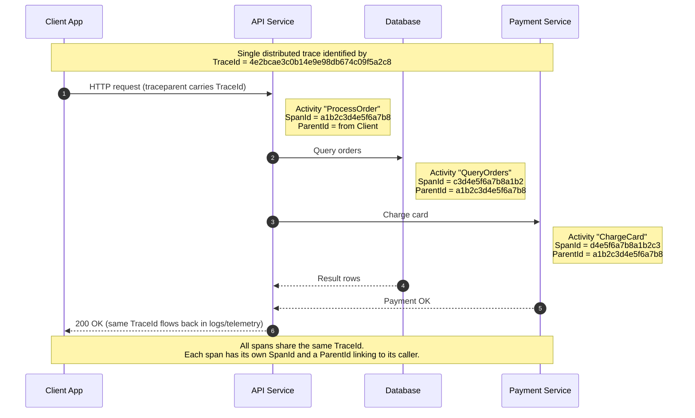
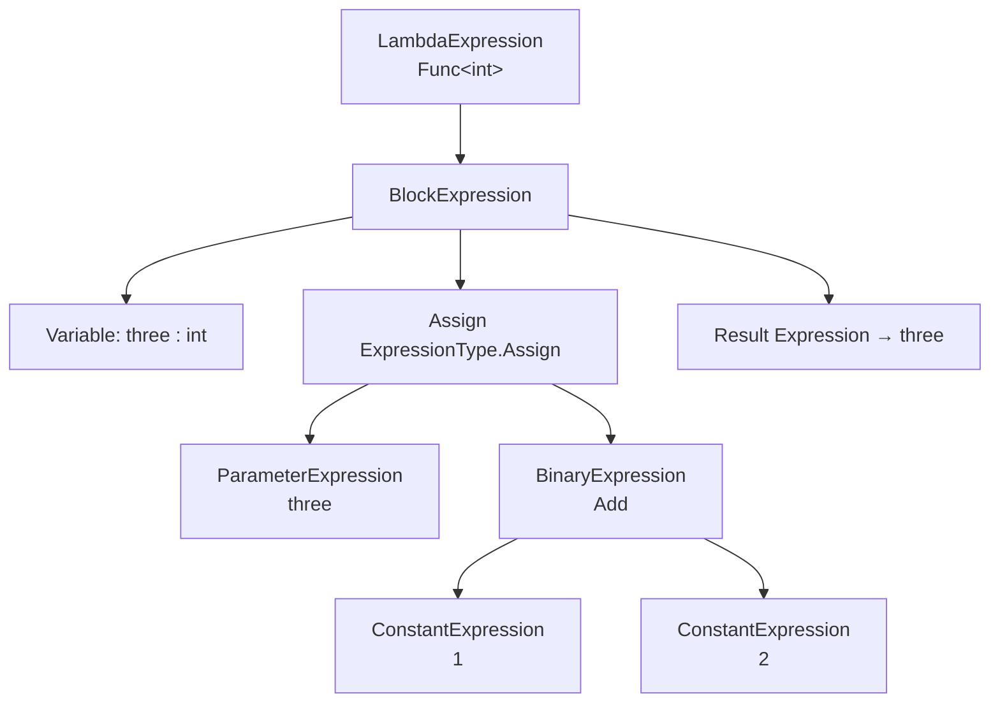

**Tracing**

```mermaid
sequenceDiagram
    autonumber
    participant C as Client App
    participant API as API Service
    participant DB as Database
    participant PAY as Payment Service

    Note over C, PAY: Single distributed trace identified by <br/> TraceId = 4e2bcae3c0b14e9e98db674c09f5a2c8

    C->>API: HTTP request (traceparent carries TraceId)
    Note right of API: Activity "ProcessOrder"<br/>SpanId = a1b2c3d4e5f6a7b8<br/>ParentId = from Client

    API->>DB: Query orders
    Note right of DB: Activity "QueryOrders"<br/>SpanId = c3d4e5f6a7b8a1b2<br/>ParentId = a1b2c3d4e5f6a7b8

    API->>PAY: Charge card
    Note right of PAY: Activity "ChargeCard"<br/>SpanId = d4e5f6a7b8a1b2c3<br/>ParentId = a1b2c3d4e5f6a7b8

    DB-->>API: Result rows
    PAY-->>API: Payment OK
    API-->>C: 200 OK (same TraceId flows back in logs/telemetry)

    Note over C, PAY: All spans share the same TraceId. <br/>Each span has its own SpanId and a ParentId linking to its caller.
```

```mermaid
graph TD
    L[LambdaExpression<br/>Func&lt;int&gt;] --> B[BlockExpression]
    B --> V[Variable: three : int]
    B --> A[Assign ExpressionType.Assign]
    A --> P[ParameterExpression<br/>three]
    A --> ADD[BinaryExpression<br/>Add]
    ADD --> C1[ConstantExpression<br/>1]
    ADD --> C2[ConstantExpression<br/>2]
    B --> R[Result Expression → three]
```